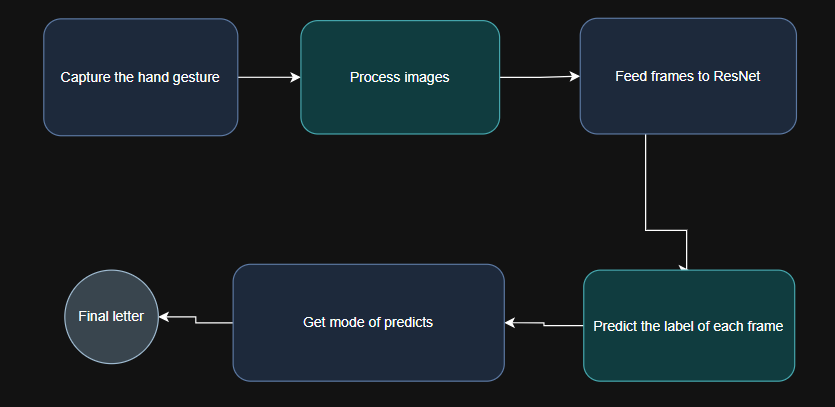
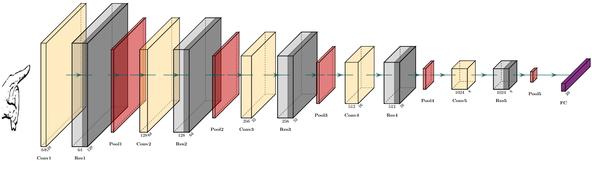

# HandSpeak: Real-time American Sign Language Recognition

HandSpeak is a real-time American Sign Language (ASL) recognition system that uses a ResNet model for gesture classification. The system captures hand gestures through a webcam, processes the images, and predicts the corresponding ASL letter or command.

## Table of Contents
- [HandSpeak: Real-time American Sign Language Recognition](#handspeak-real-time-american-sign-language-recognition)
  - [Table of Contents](#table-of-contents)
  - [Outcome Video (v1)](#outcome-video-v1)
  - [Installation](#installation)
  - [Usage](#usage)
  - [Project Structure](#project-structure)
  - [Workflow Diagram (v1)](#workflow-diagram-v1)
  - [Model Architecture (v1)](#model-architecture-v1)
  - [Data Preparation](#data-preparation)
  - [Training the Model](#training-the-model)
  - [Running the Application](#running-the-application)
  - [To-Do](#to-do)


## Outcome Video (v1)

Watch the outcome video demonstrating the HandSpeak system in action:


## Installation

1. Clone the repository:
    ```bash
    git clone https://github.com/yourusername/HandSpeak.git
    cd HandSpeak
    ```

2. Create a virtual environment and activate it:
    ```bash
    python -m venv venv
    source venv/bin/activate  # On Windows use `venv\Scripts\activate`
    ```

3. Install the required packages:
    ```bash
    pip install -r requirements.txt
    ```

## Usage

1. Prepare the dataset by following the instructions in the [Data Preparation](#data-preparation) section.
2. Train the model by following the instructions in the [Training the Model](#training-the-model) section.
3. Run the application:
    ```bash
    python main.py
    ```

## Project Structure

```
HandSpeak/
│
├── notebooks/
│   ├── prepare_data.ipynb         # Notebook for preparing the dataset
│   ├── train_model.ipynb          # Notebook for training the model
│
├── src/
│   ├── models/
│   │   └── resnet.py              # ResNet model definition
│   ├── handspeak.py               # Main application logic
│
├── main.py                        # Entry point for running the application
├── requirements.txt               # Required packages
└── README.md                      # Project documentation
```

## Workflow Diagram (v1)

The following diagram illustrates the workflow of the HandSpeak system:



## Model Architecture (v1)

The ResNet model used in this project consists of multiple convolutional layers followed by residual blocks and fully connected layers. The architecture is defined in `src/models/resnet.py`.

The ResNet model architecture used in this project is shown below:



made by [PlotNeuralNet](https://github.com/HarisIqbal88/PlotNeuralNet)

## Data Preparation

1. Open the `notebooks/prepare_data.ipynb` notebook.
2. Follow the instructions to create directories for training and testing data.
3. Collect hand gesture images using OpenCV and process them before saving.

## Training the Model

1. Open the `notebooks/train_model.ipynb` notebook.
2. Follow the instructions to load the dataset, define the model, and train it.
3. Save the trained model weights.

## Running the Application

1. Ensure that the trained model weights are saved in the `weights` directory.
2. Run the application:
    ```bash
    python main.py
    ```

## To-Do

- [ ] Optimize the data processing pipeline.
- [ ] Explore alternative model architectures.
- [ ] Use MediaPipe to get full focus on the hand by detecting hand landmarks, cropping the hand region, and ensuring it remains the primary focus in the frame.