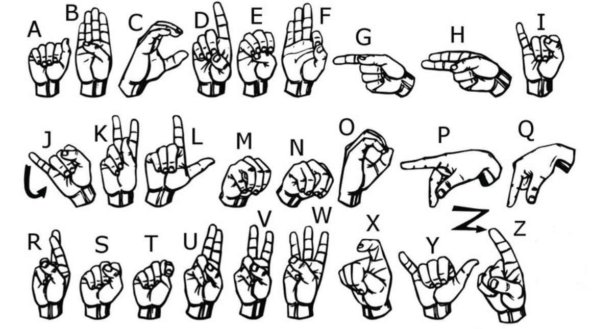
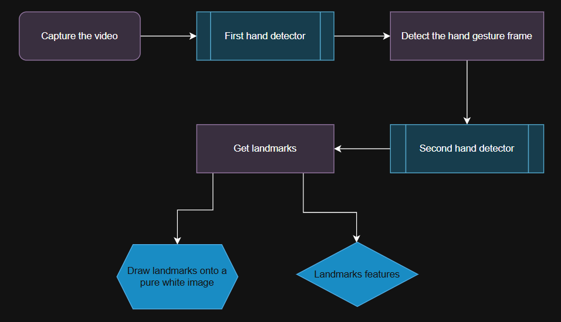
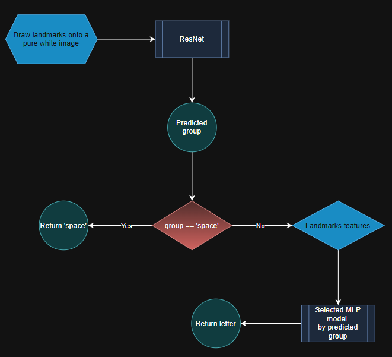
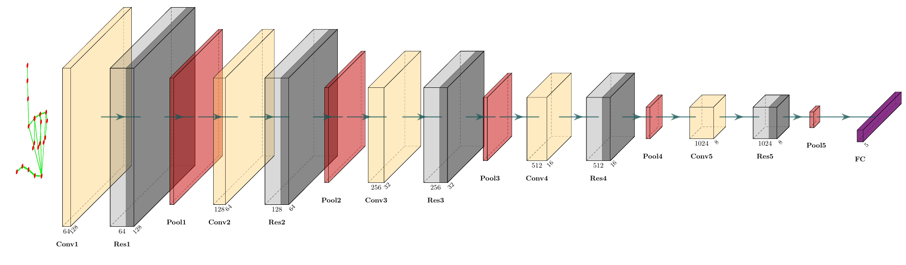

# HandSpeak: Real-Time American Sign Language Recognition System

HandSpeak is a real-time American Sign Language (ASL) recognition system that uses computer vision and deep learning to identify hand gestures and translate them into text. The system leverages hand landmarks, ResNet for group classification, and multiple MLP models for specific letter predictions.

---

## Features
- **Real-Time Gesture Recognition**: Detects and classifies ASL gestures in real-time using a webcam.
- **Hierarchical Classification**: Uses a ResNet model to classify gestures into broad groups and MLP models for specific letter predictions.
- **Landmark-Based Detection**: Utilizes hand landmarks for robust recognition across varying lighting conditions and backgrounds.
- **GUI Integration**: Displays recognized letters and words in a user-friendly Tkinter-based interface.

---

## Table of Contents
- [HandSpeak: Real-Time American Sign Language Recognition System](#handspeak-real-time-american-sign-language-recognition-system)
  - [Features](#features)
  - [Table of Contents](#table-of-contents)
  - [Hand Gestures](#hand-gestures)
  - [Outcome Video](#outcome-video)
  - [Project Structure](#project-structure)
  - [Installation](#installation)
  - [Usage](#usage)
  - [Data Preparation](#data-preparation)
  - [Training the Model](#training-the-model)
  - [Models](#models)
    - [ResNet](#resnet)
    - [MLP](#mlp)
  - [Labels](#labels)
  - [Utilities](#utilities)
    - [`measure_funcs.py`](#measure_funcspy)
  - [Data Collection Pipeline](#data-collection-pipeline)
  - [Letter Prediction Pipeline](#letter-prediction-pipeline)
    - [ResNet Architecture](#resnet-architecture)
    - [MLPs Architecture](#mlps-architecture)
  - [Conclusion](#conclusion)
  - [To-Do](#to-do)
  - [Contributing](#contributing)
  - [License](#license)

## Hand Gestures

Different Fingerspelling in this project



---

## Outcome Video

Watch the outcome video demonstrating the HandSpeak system in action:

https://github.com/user-attachments/assets/25a0ad2d-a39e-4b76-ac6a-d45995f8c5f6

---

## Project Structure
```
HandSpeak/
├── main.py                # Entry point for the application
├── src/
│   ├── handspeak.py       # Core logic for gesture detection and classification
│   ├── models/
│   │   ├── resnet.py      # ResNet model for group classification
│   │   ├── mlp.py         # MLP models for specific letter prediction
│   ├── notebooks/
│   │   ├── prepare_data.ipynb  # Data preparation and collection
│   │   ├── train_model.ipynb   # Model training scripts
│   ├── utils/
│   │   ├── measure_funcs.py    # Utility functions for distance and angle calculations
│   ├── labels.json        # Encoded labels for gesture groups
```
---

## Installation

1. Clone the repository:
    ```bash
    git clone https://github.com/yourusername/HandSpeak.git
    cd HandSpeak
    ```

2. Create a virtual environment and activate it:
    ```bash
    python -m venv venv
    source venv/bin/activate  # On Windows use `venv\Scripts\activate`
    ```

3. Install the required packages:
    ```bash
    pip install -r requirements.txt
    ```
---

## Usage

1. Prepare the dataset by following the instructions in the [Data Preparation](#data-preparation) section.
2. Train the model by following the instructions in the [Training the Model](#training-the-model) section.
3. Run the application:
    ```bash
    python main.py
    ```
---

## Data Preparation

1. Open the `src/notebooks/prepare_data.ipynb` notebook.
2. Follow the instructions to create directories for training and testing data.
3. Collect hand gesture images using OpenCV and process them before saving.

## Training the Model

1. Open the `src/notebooks/train_model.ipynb` notebook.
2. Follow the instructions to load the dataset, define the model, and train it.
3. Save the trained model weights.

---

## Models
### ResNet
- Used for classifying gestures into broad groups (`AMNSTE`, `DFBUVLKRW`, `COPQZX`, `GHYJI`).
- Implements residual blocks for efficient feature extraction.

### MLP
- Predicts specific letters within each group.
- Lightweight and optimized for real-time inference.

---

## Labels
The `labels.json` file maps ASCII codes to gesture groups:
```json
{
     "amnste": { "97": 0, "101": 1, "109": 2, "110": 3, "115": 4, "116": 5 },
     ...
}
```

---

## Utilities
### `measure_funcs.py`
- **`euclidean_distance`**: Calculates the distance between two points.
- **`calculate_angle`**: Computes the angle between two points.
- **`is_above`**: Determines if one point is above another.

---

## Data Collection Pipeline

The diagram below shows how images are collected, you can find more details in `src/notebooks/prepare_data.ipynb`.



---

## Letter Prediction Pipeline
The two outputs of the previous section, `landmark features` and `landmarks drawn onto a pure white image` serve as inputs for this section to predict the specific letter.



### ResNet Architecture



Created with [PlotNeuralNet](https://github.com/HarisIqbal88/PlotNeuralNet)

### MLPs Architecture


First layer (# features)-> 15 neurons
Second layer (hidden layer) -> 128 neurons
Third layer (hidden layer) -> 64 neurons
Fourth layer (hidden layer) -> 32 neurons
Final layer (predicted letters) -> depends on group letters, For example in this image there are 6 neurons in final layer

---

## Conclusion

The training process demonstrates that the ResNet model effectively learns the dataset, achieving near-perfect accuracy on the test set.

The following table presents the final loss values for each of the MLP models after training:

| Model Name   | Final Loss |
|-------------|------------|
| **amnste**   | 0.3044     |
| **dfbuvlkrw** | 0.3017     |
| **ghyji**    | 0.0293     |
| **copqzx**   | 1.6452     |

You can find more details in `src/notebooks/train_model.ipynb`.

---

## To-Do

- [x] Optimize the data processing pipeline.
- [ ] Explore alternative model architectures.
- [x] Use MediaPipe to get full focus on the hand by detecting hand landmarks, cropping the hand region, and ensuring it remains the primary focus in the frame.
- [ ] Better word transition between predicts.
- [ ] Add more and better numeric features to get better accuracy for each MLP model.
- [ ] Add AutoCorrect system for typed text.

---

## Contributing
Contributions are welcome! Feel free to submit issues or pull requests.

---

## License
This project is licensed under the MIT License.
